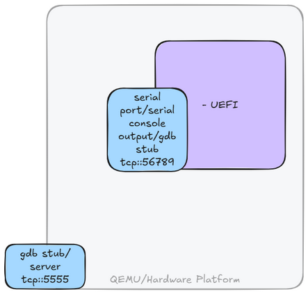
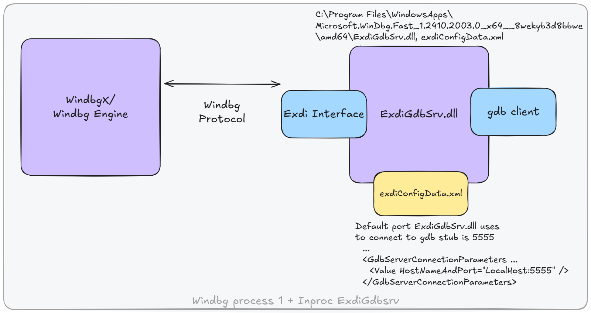
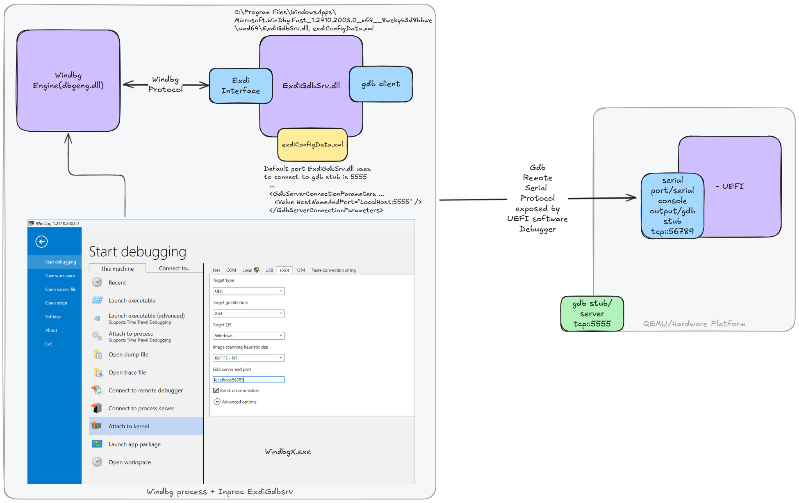
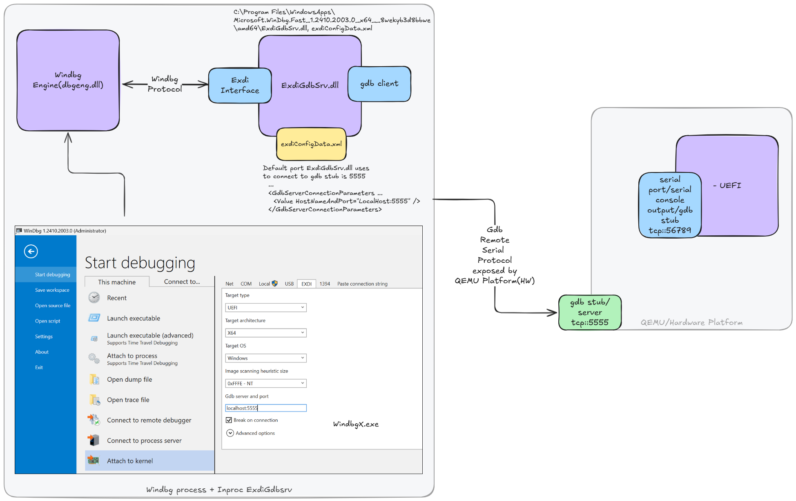
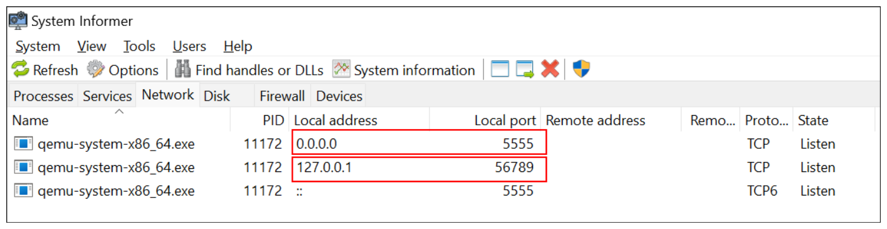
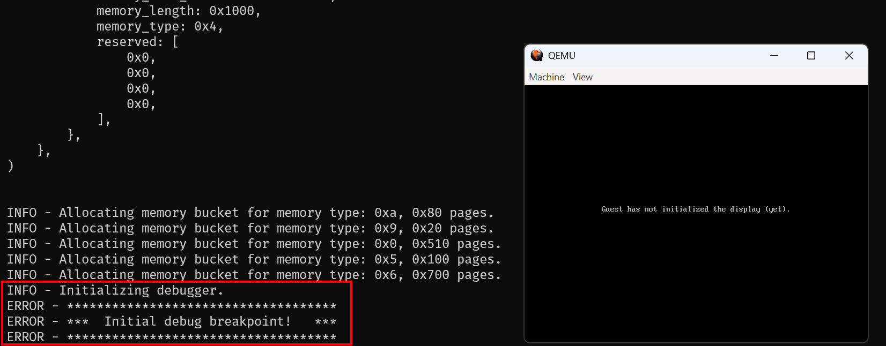
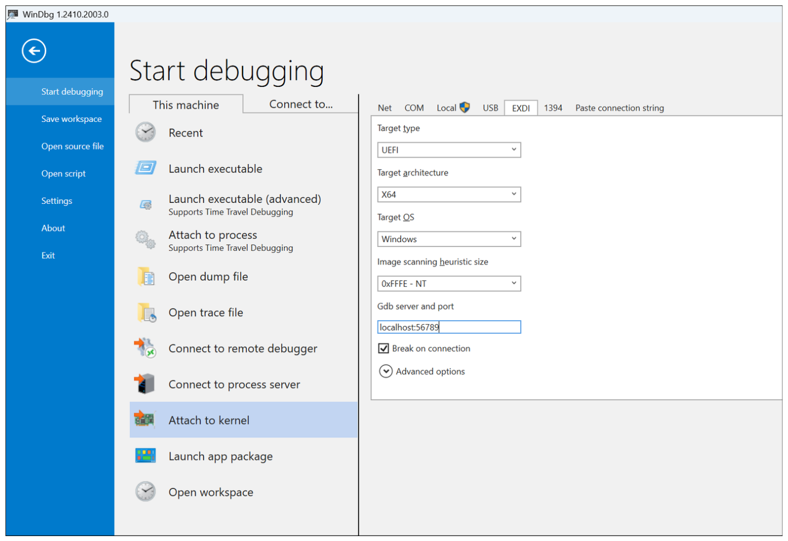
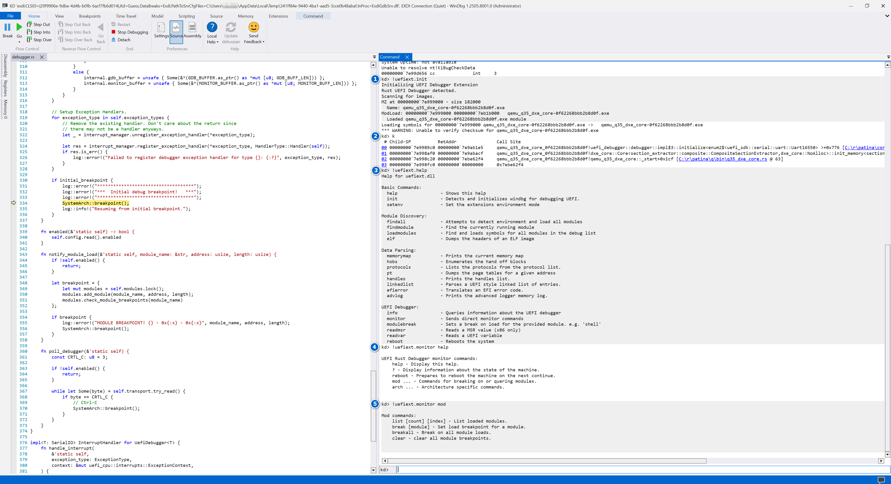
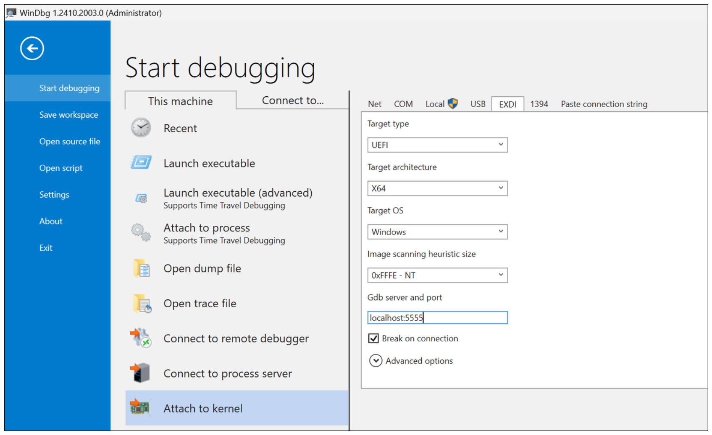

# 🐞 WinDbg + QEMU + Patina UEFI - Debugging Guide

## Overview

QEMU can expose two serial ports—one for **software debugging** and another for **hardware debugging**.

- **Software Debugging Serial Port**
  Used for communicating with the UEFI SW debugger.

- **Hardware Debugging Serial Port**
  Used for low-level QEMU Hardware debugging

Each serial port can be used independently or simultaneously. Both serial ports
expose the [GDB Remote Serial Protocol](https://ftp.gnu.org/old-gnu/Manuals/gdb/html_node/gdb_125.html).



[WinDbg](https://learn.microsoft.com/en-us/windows-hardware/drivers/debuggercmds/windbg-overview)
communicates with QEMU using the [EXDi
Interface](https://learn.microsoft.com/en-us/windows-hardware/drivers/debugger/configuring-the-exdi-debugger-transport).
In essence, the EXDi interface allows WinDbg to interact with transports like
[GDB Remote Serial Protocol](https://ftp.gnu.org/old-gnu/Manuals/gdb/html_node/gdb_125.html), which QEMU provides.

The `ExdiGdbSrv.dll` in WinDbg acts as a GDB client.



---

### End-to-End Communication Flow

#### Software Debugging: WinDbg ↔ EXDi ↔ GDB Stub ↔ Serial Port ↔ UEFI Debugger



#### Hardware Debugging: WinDbg ↔ EXDi ↔ GDB Stub ↔ Serial Port ↔ QEMU HW



---

## Setting Up WinDbg

### Step 1: Install WinDbg

- Download [Windbg](https://learn.microsoft.com/windows-hardware/drivers/debugger/)
- It will be installed to:
  `C:\Program Files\WindowsApps\Microsoft.WinDbg.Fast_1.xxxxxxxxx\amd64`

Contains:

- `ExdiGdbSrv.dll`
- `exdiConfigData.xml`

### Step 2: Install UEFI WinDbg Extension

- Download the latest release from:
  [mu_feature_debugger releases](https://github.com/microsoft/mu_feature_debugger/releases/latest)
- Extract it to:
  `%LOCALAPPDATA%\Dbg\EngineExtensions\`

---

## Building Patina with Debugging Enabled

Clone [patina-dxe-core-qemu](https://github.com/OpenDevicePartnership/patina-dxe-core-qemu) repo to `C:\r\patina-dxe-core-qemu`

In `C:\r\patina-dxe-core-qemu\bin\q35_dxe_core.rs`, modify the `DEBUGGER` initialization:

**Before:**

```rust
.with_default_config(false, true, 0)
```

**After:**

```rust
.with_default_config(true, true, 0)
```

Then build using:

```sh
cargo build_q35
```

This produces the dxe core binary at:
`target\x86_64-unknown-uefi\debug\qemu_q35_dxe_core.efi`

---

## Launch QEMU with Patina UEFI

### Option 1: Full Rebuild with UEFI Rust Codebase

> 🕐 This is slower due to a full rebuild of the UEFI firmware.

Ensure the patina-qemu repo is cloned:

- [patina-qemu](https://github.com/OpenDevicePartnership/patina-qemu) to `C:\r\patina-qemu`

Launch QEMU with serial and GDB support:

```sh
stuart_build -c Platforms/QemuQ35Pkg/PlatformBuild.py TOOL_CHAIN_TAG=VS2022 GDB_SERVER=5555 SERIAL_PORT=56789  --FlashRom BLD_*_DXE_CORE_BINARY_PATH="C:\r\patina-dxe-core-qemu\target\x86_64-unknown-uefi"
```

---

### Option 2: Patch Existing Firmware Image (Faster Dev Loop)

Ensure both repos are cloned:

- [patina-qemu](https://github.com/OpenDevicePartnership/patina-qemu) to `C:\r\patina-qemu`
- [patina-fw-patcher](https://github.com/OpenDevicePartnership/patina-fw-patcher) to `C:\r\patina-fw-patcher`

Then run:

```sh
cd C:\r\patina-qemu
python .\build_and_run_rust_binary.py --fw-patch-repo C:\r\patina-fw-patcher --custom-efi C:\r\patina-dxe-core-qemu\target\x86_64-unknown-uefi\debug\qemu_q35_dxe_core.efi -s 56789 -g 5555
```

This should launch QEMU and waits for the initial break in:





---

## Launching WinDbg Instances

### Instance 1: Software Debugging

1. Launch **WinDbg**. This will connect to QEMU SW serial port(`56789`)

   

2. Set symbol and source paths:

   ```cmd
   .sympath+ <path to pdb dir> ; usually <cloned dir>\target\x86_64-unknown-uefi\debug\deps
   .srcpath+ <path to src dir> ; usually <cloned dir>\src
   ```

3. Initialize the UEFI debugger extension:

   ```cmd
   !uefiext.init
   ```

4. `!uefiext.help` will list all available commands

   

---

### Instance 2: Hardware Debugging (Optional)

1. Launch another **WinDbg** instance

   

2. It should automatically connect to the QEMU HW serial port(`5555`).
