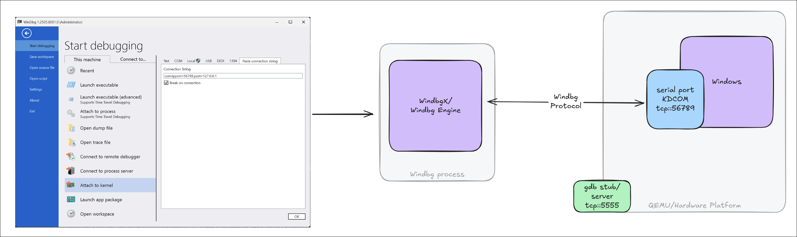
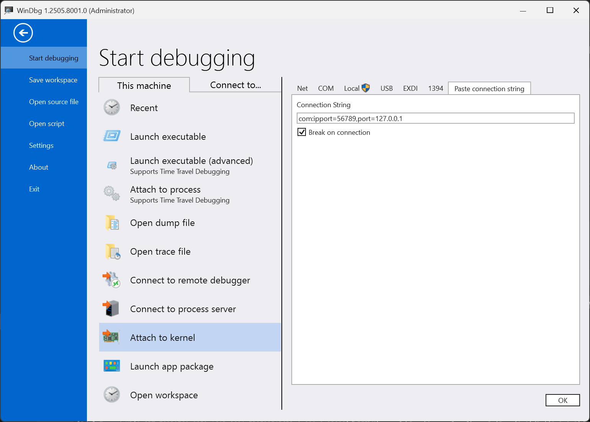
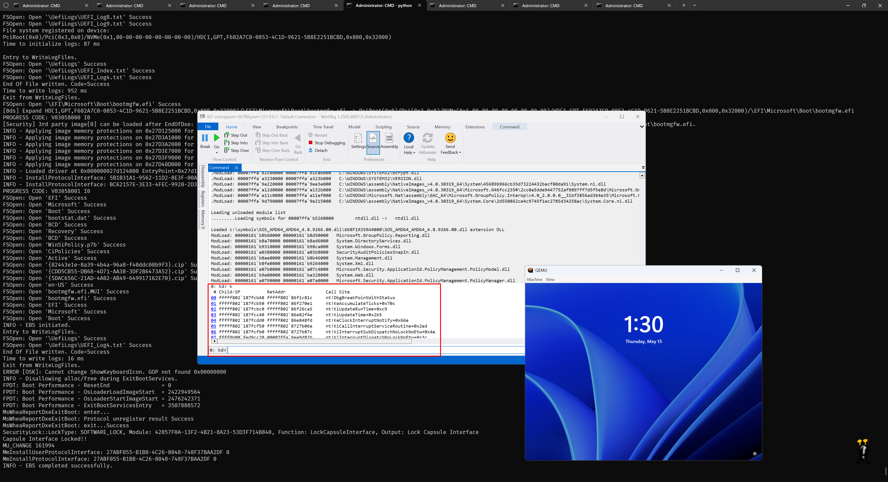

# 🐞 WinDbg + QEMU + Patina UEFI + 🪟 Windows OS - Debugging Guide

In addition to the steps discussed in [WinDbg QEMU UEFI
Debugging](windbg-qemu-uefi-debugging.md), this document describes how to launch
Windows and perform kernel debugging on QEMU. Unlike UEFI software debugger and
QEMU hardware debugger, Windows does not require EXDi, as it natively
communicates with WinDbg using the KDCOM transport.



## Prepare the OS Image

1. Download the original OS image in either VHDX or QCOW2 format. If the image
   has never been booted before, you can use Hyper-V to boot it once and
   complete the OOBE (Out-of-Box Experience) process, if any. Recommended
   references:

   - [Enable Hyper-V on Windows 11](https://learn.microsoft.com/en-us/windows-server/virtualization/hyper-v/get-started/Install-Hyper-V)
   - [Create a Virtual Machine with Hyper-V](https://learn.microsoft.com/en-us/windows-server/virtualization/hyper-v/get-started/create-a-virtual-machine-in-hyper-v)

2. Although QEMU supports both VHDX and QCOW2 formats, using a QCOW2 image is
   recommended for reliability. You can convert a VHDX image to QCOW2 using:

   ```sh
   qemu-img convert -f vhdx -p -c -O qcow2 Windows11.vhdx Windows11.qcow2
   ```
> `qemu-img.exe` is present in QEMU installation path(`C:\Program Files\qemu`)

## Launch QEMU with Patina UEFI and Windows

> If you do not want to debug Patina UEFI, skip the [Building Patina with Debugging Enabled](windbg-qemu-uefi-debugging.md#Building-Patina-with-Debugging-Enabled) section in `windbg-qemu-uefi-debugging.md`.

### Option 1: Full Rebuild with UEFI Rust Codebase

> 🕐 Slower, as it requires a full rebuild of the UEFI firmware.

Ensure the `patina-qemu` repository is cloned to:

- [`C:\r\patina-qemu`](https://github.com/OpenDevicePartnership/patina-qemu)

Then launch QEMU with serial and GDB support:

```sh
stuart_build -c Platforms/QemuQ35Pkg/PlatformBuild.py TOOL_CHAIN_TAG=VS2022 GDB_SERVER=5555 SERIAL_PORT=56789 --FlashRom BLD_*_DXE_CORE_BINARY_PATH="C:\r\patina-dxe-core-qemu\target\x86_64-unknown-uefi" PATH_TO_OS="C:\Windows11.qcow2"
```

> Key parameter to pass: `PATH_TO_OS="C:\Windows11.qcow2"`

---

### Option 2: Patch Existing Firmware Image (Faster Dev Loop)

Ensure both repositories are cloned:

- [`patina-qemu`](https://github.com/OpenDevicePartnership/patina-qemu) → `C:\r\patina-qemu`
- [`patina-fw-patcher`](https://github.com/OpenDevicePartnership/patina-fw-patcher) → `C:\r\patina-fw-patcher`

Then run:

```sh
cd C:\r\patina-qemu
python .\build_and_run_rust_binary.py --fw-patch-repo C:\r\patina-fw-patcher --custom-efi C:\r\patina-dxe-core-qemu\target\x86_64-unknown-uefi\debug\qemu_q35_dxe_core.efi -s 56789 -g 5555 --os "C:\Windows11.qcow2"
```

> Key parameter to pass: `--os "C:\Windows11.qcow2"`

This will launch QEMU normally, and Windows should boot.

## Enable Kernel Debugging on QEMU Guest (Windows)

After booting to the Windows desktop, open a Command Prompt and run the following commands to enable kernel and boot debugging (optional):

```cmd
bcdedit /dbgsettings serial debugport:1 baudrate:115200
bcdedit /set {default} debug on
bcdedit /set {default} bootdebug on
shutdown -r -t 0   # reboot for above settings to take effect
```

## Launch WinDbg for Kernel Debugging

Once Windows reboots, run the following command to connect WinDbg:

```sh
windbgx -k com:port=56789,pipe=127.0.0.1 -v
```
or via UI


> Replace `56789` with the serial port used during QEMU launch.



## Serial Console for UEFI

Use a terminal application such as PuTTY or Tera Term to connect to the `<port number>` you configured for QEMU, using the Raw TCP/IP protocol to `127.0.0.1`.

**Notes:**

- You must release this console for the kernel debugger to attach.
- Some terminal applications enable "local line editing" by default on raw connections. This should be turned off to avoid sending garbage keystrokes.

