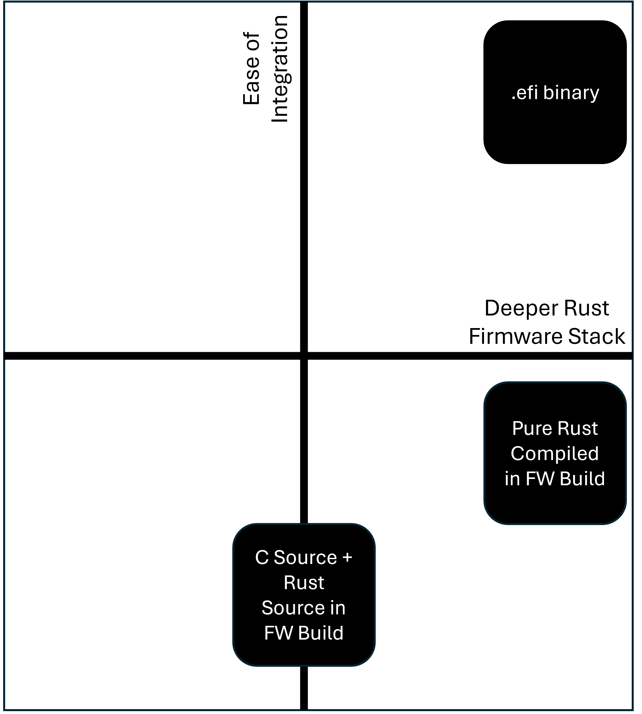

# Patina Platform Repository

This repository demonstrates how to integrate [Patina](https://github.com/OpenDevicePartnership/patina/blob/main/docs/src/patina.md)
into a UEFI platform build.

## Repository Background

This repository is a permanent fork of [mu_tiano_platforms](https://github.com/microsoft/mu_tiano_platforms) which is
itself a permanent fork of the [OvmfPkg in edk2](https://github.com/tianocore/edk2/tree/HEAD/OvmfPkg). The reason for
a permanent fork is to allow this repository to be independently used within the ownership of the Patina project and,
in doing so, optimized for Rust UEFI development.

## Getting Started

This repository is meant to be a "first stop" for developers exploring Patina in practice - how it would be integrated
in a UEFI platform. Depending on your background, you may find the following entry points to Patina useful:

- All:
  - [Patina Overview](https://github.com/OpenDevicePartnership/patina/blob/main/docs/src/patina.md)
- Interested in the Patina DXE Core?
  - [High-Level Differences of Patina DXE Core vs EDK II DXE Core](https://github.com/OpenDevicePartnership/patina/blob/main/docs/src/integrate/rust_vs_edk2.md)
- Developers:
  - [Developer Introduction](https://github.com/OpenDevicePartnership/patina/blob/main/docs/src/introduction.md)
  - [Patina Code Organization](https://github.com/OpenDevicePartnership/patina/blob/main/docs/src/dev/code_organization.md)
  - [The Patina Component Model](https://github.com/OpenDevicePartnership/patina/blob/main/docs/src/dxe_core/component_model.md)
  - [General Rust Resources](https://github.com/OpenDevicePartnership/patina/blob/main/docs/src/dev/other.md)

## High-Level Overview of Rust Integration Into Platforms

As Rust is integrated into more production platforms, it is important to understand the options available and where
this repository fits in. Recognizing that UEFI inherently supports dynamic integration, at the highest level, there are
two approaches for writing UEFI firmware in Rust:

1. Build the code using Rust tools in a Pure Rust workspace against the UEFI target triple and integrate the resulting
   .efi binary into the platform firmware build process.
   - This is the primary approach taken in this repository.
2. Support for building Rust source code in the firmware build process. If using the EDK II build process, this means
   compiling Rust source code alongside the C source code when building code specified in a DSC file.

We generally recommend **(1)** as the preferred approach for the following reasons:

- It allows for a more natural Rust development experience directly using Rust tools and processes for Rust code.
- It greatly simplifies the firmware build process as it does not need to be enlightened for building Rust code.

This repository integrates Patina code using **(1)** and demonstrates how **(2)** can be used for Rust code
external to Patina to provide a complete example of how to integrate Rust into a UEFI platform build.

In the diagram below, **(1)** is ".efi binary" and **(2)** is either of the other blocks in the diagram depending on
which method is selected.

Ease of integration decreases when not directly using a .efi binary because the EDK II build process must be updated
to support build rules for Rust code. The coupling of the EDK II build system with the Rust/Cargo build system
introduces additional complexity alongside EDK II workspace requirements causing friction with Rust workspace
conventions. EDK II customizations such as PCDs are not natively supported in Rust. Conversely, Rust feature flags
are not supported in the EDK II build process. This further increases integration complexity as consumers must
understand multiple types of customization and how they may cooperate with each other. When Pure Rust code is built
into a .efi binary in **(1)**, that best ensures consumers they are using a "Rust implementation". It is possible that
Rust build may have had C code linked into the binary with a FFI, but that is not a practice in Patina.



Since **(1)** is the preferred approach, we will focus on that in this document. However, it is important to note that
**(2)** is also a valid approach and can be used in conjunction with **(1)**. More details on **(2)** are provided in
the collapsed section below if you are interested in understanding more about that approach.

<details>
<summary>Click to expand for more details on <b>(2)</b></summary>
As of today, [tianocore/edk2](https://github.com/tianocore/edk2) does not support **(2)**. The [Project Mu](https://microsoft.github.io/mu/)
open-source project does.

**(2)** is particularly useful for linking Rust code with C code in a given module. However, several combinations are
possible with today's support:

- **C source** + **Rust source mixed in INF** (Library or Module)
  - Rust source code is recognized and supported by an EDK II build rule – Rust-To-Lib-File (.rs => .lib)
- **Pure Rust Module only**.
  - A Cargo.toml file is added to INF file as source.
  - Rust Module build is supported by EDK II build rule – Toml-File.RUST_MODULE (.toml => .efi)
- **Pure Rust Module** + **Pure Rust Library with Cargo Dependency**.
  - The cargo dependency means the rust lib dependency declared in Cargo.toml.
- **Pure Rust Module** + **C Library with EDK II Dependency**.
  - Rust Module build is supported by EDK II build rule – Toml-File (.toml => .lib)
  - The EDK II dependency means the EDK II lib dependency declared in INF.
    - If a rust module is built with C, the cargo must use `staticlib`. Or, `rlib` should be used.
- **C Module** + **Pure Rust Library with EDK II Dependency**.
  - Rust Lib build is supported by EDK II build rule – Toml-File. (.toml => .lib)
- **Pure Rust Module** + **Pure Rust Library with EDK II Dependency**.
  - Same as combining others from above.

After experimenting with **(2)**, we have found that while it  is how most projects initially consider integrating Rust
into their codebase but in practice the integration complexity is high due to the ability to cointegrate the Rust/Carg
build system with the EDK II build system and it naturally leads to Rust source code being maintained in the C codebase
which is not ideal due to language and tooling differences.
</details>

## First-Time Tool Setup Instructions For This Repository

There are two platforms currently supported in this repository - `QemuQ35Pkg` and `QemuSbsaPkg`.

- [QemuQ35Pkg](https://github.com/OpenDevicePartnership/patina-qemu/tree/main/Platforms/QemuQ35Pkg)
  - Intel Q35 chipset with ICH9 south bridge
  - This demonstrates x86/x64 UEFI firmware development with Patina.
  - [QemuQ35Pkg Detailed Info](https://github.com/OpenDevicePartnership/patina-qemu/blob/main/Platforms/Docs/Q35/QemuQ35_ReadMe.md)
- [QemuSbsaPkg](https://github.com/OpenDevicePartnership/patina-qemu/tree/main/Platforms/QemuSbsaPkg)
  - ARM Server Base System Architecture
  - This demonstrates AARCH64 UEFI firmware development with Patina.
  - Note: `QemuSbsaPkg` could build in the past on Windows using the `CLANGPDB` toolchain. However, this is no longer
    possible due to some code that is part of the build that only builds only Linux at this time.
  - [QemuSbsaPkg Detailed Info](https://github.com/OpenDevicePartnership/patina-qemu/blob/main/Platforms/Docs/SBSA/QemuSbsa_ReadMe.md)

The following instructions install Rust.

1. Since this repository will be built using the [stuart tools](https://github.com/tianocore/edk2-pytool-extensions?tab=readme-ov-file#tianocore-edk2-pytool-extensions-edk2toolext)
in the Tianocore project, setup the pre-requisites described in [How to Build with Stuart](https://github.com/tianocore/tianocore.github.io/wiki/How-to-Build-With-Stuart).
2. With that done, it is recommended you start by following the [instructions to build `QemuQ35Pkg`](https://github.com/OpenDevicePartnership/patina-qemu/blob/main/Platforms/Docs/Common/building.md).

Using those instructions, your commands will look like the following to build `QemuQ35Pkg` on Windows:

1. Clone this repo:

    \>`cd <your source directory>`

    \>`git clone https://github.com/OpenDevicePartnership/patina-qemu.git`

2. Setup and activate a local Python virtual environment.

    \>`py -3 -m venv patina.venv`

    \>`.\patina.venv\Scripts\Activate.ps1`
    > Use the script that works with your environment (e.g. .ps1 for PowerShell, .bat for "cmd").

3. Switch to the enlistment and install pip modules.

    \>`cd patina-qemu`

    \>`pip install --upgrade -r pip-requirements.txt`

4. Fetch submodules and external dependencies.

    `>stuart_setup -c Platforms\QemuQ35Pkg\PlatformBuild.py`

    `>stuart_update -c Platforms\QemuQ35Pkg\PlatformBuild.py`

5. Compile the firmware (above steps are only required to configure the enlistment; subsequent builds can just run
   this command).

    \>`stuart_build -c Platforms\QemuQ35Pkg\PlatformBuild.py`

6. Verify that your UEFI build can successfully execute on QEMU by passing the `--FlashRom` argument to the build:

    \>`stuart_build -c Platforms\QemuQ35Pkg\PlatformBuild.py --FlashRom`

You can then apply that knowledge to build the platform you're interested in with the `PlatformBuild.py` files located
in the platform package directory.

After you run the firmare you've built on QEMU (for example, adding `--flashrom` to the end of the `stuart_build`
command), you've successfully built and run the Patina DXE Core! No Rust tools are needed since right now, you are
using the "simpler" model of the Rust code coming into the firmware build through a .efi binary.

If you are interested in installing the Rust tools, follow the instructions in the [patina repo readme](https://github.com/OpenDevicePartnership/patina?tab=readme-ov-file#first-time-tool-setup-instructions)
and start by building the code in the [patina repo](https://github.com/OpenDevicePartnership/patina).

## Advanced Usage

If you are using this repository often and to test Rust changes you are developing, you may want to consider the
following advanced usage options.

### Patching the Patina DXE Core Into a QEMU UEFI ROM

The fastest way to test changes to Rust code on QEMU is to use a Patina tool called "FW Patcher" that automates the
process of building the Rust code and then patching it directly into an existing QEMU UEFI ROM image. This is
significantly faster than building the entire platform firmware using the normal Stuart build process and is often
completed within a few seconds.

The `FW Patcher` tool is located in  the [patina-fw-patcher](https://github.com/OpenDevicePartnership/patina-fw-patcher)
repository. Review the [readme](https://github.com/OpenDevicePartnership/patina-fw-patcher?tab=readme-ov-file#firmware-rust-patcher)
in that repository for instructions on how to use it a s standalone script.

To further simplify the process of using the tool in this repository, a script is provided in this repository called
[build_and_run_rust_binary.py](https://github.com/OpenDevicePartnership/patina-qemu/blob/main/build_and_run_rust_binary.py)
that can be called to:

1. Build your Rust changes
2. Patch the resulting Patina DXE Core .efi binary into your local `patina-qemu` UEFI ROM image.
3. Start QEMU with the patched UEFI ROM image.

For more details about how to run the script, review the script help information locally:

```bash
>python build_and_run_rust_binary.py --help
```

> Note: Because this is only patching an existing QEMU ROM image, if you make changes to the platform firmware code
> (e.g. C code), you will need to run the full Stuart build process to build a new ROM image with those changes and
> then use the `FW Patcher` tool to patch the Patina DXE Core .efi binary into that new ROM image.

> Note: The `FW Patcher` tool can patch more than just the Patina DXE Core. If you need help patching other binaries,
> please start a discussion in [patina-fw-patcher Discussions area](https://github.com/OpenDevicePartnership/patina-fw-patcher/discussions/categories/q-a.)

### Substituting a Local DXE Core Into the Stuart Build

The Patina DXE Core binary used in the platform build of this repository is specified as an "external dependency" in
`Platforms\QemuQ35Pkg\Binaries\dxe_core_ext_dep.yaml` (for `QemuQ35Pkg`). The binary can be overridden locally by
in your build command by passing `BLD_*_DXE_CORE_BINARY_PATH` with the path to the directory containing the DXE Core
.efi binary to the Stuart build command.

Example:

```bash
>stuart_setup -c Platforms\QemuQ35Pkg\PlatformBuild.py --flashonly BLD_*_DXE_CORE_BINARY_PATH=C:\src\patina-dxe-core-qemu\target\x86_64-unknown-uefi\debug\patina_q35_dxe_core_.efi
```

### Using a Custom QEMU Installation

By default, this repository automates the process of choosing a known working QEMU version and downloading that version
into the workspace for you. If you want to use a custom QEMU installation, you can do so by passing the path to the
Stuart build command with the`QEMU_PATH` argument. For example:

```bash
>stuart_build -c Platforms\QemuQ35Pkg\PlatformBuild.py --flashonly QEMU_PATH=C:\path\to\your\qemu\bin\qemu-system-x86_64.exe
```

You can also specify the directory where the QEMU binary is located by passing the `QEMU_DIR` argument. For example:

```bash
>stuart_build -c Platforms\QemuQ35Pkg\PlatformBuild.py --flashonly QEMU_DIR=C:\path\to\your\qemu\bin
```

## Self Certification Tests

Refer to [`docs/SelfCertificationTest.md`](https://github.com/OpenDevicePartnership/patina-qemu/blob/main/docs/SelfCertifcationTest.md)
for documentation on how to configure the platform to run [Self Certification Tests (SCTs)](https://github.com/tianocore/tianocore.github.io/wiki/UEFI-SCT)
and how to run them.
